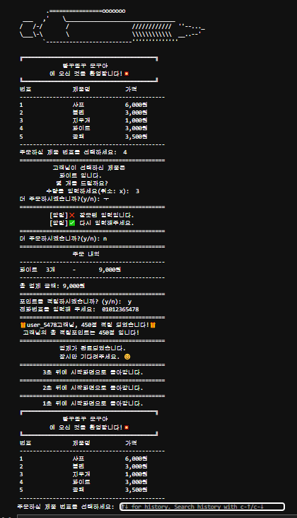

# 🌊 WhyNot 7기 소프트웨어 캠프 - 파이썬 실습 포트폴리오

이 저장소는 WhyNot 7기 소프트웨어 캠프의 파이썬 교육과정 실습 및 팀 프로젝트 결과물을 정리한 포트폴리오입니다. 파이썬 기초문법부터 실전 프로젝트까지의 모든 과정이 체계적으로 정리되어 있습니다.

---

## 📚 실습 목록

| 번호 | 파일명                                                                            | 주제                   |
| -- | ------------------------------------------------------------------------------ | -------------------- |
| 1  | [`1 variable_data_type.ipynb`](./1.%20variable_data_type.ipynb)                   | 변수, 자료형 기초           |
| 2  | [`2.복합자료형.ipynb`](./2%20.복합자료형.ipynb)                                             | 리스트, 튜플, 세트          |
| 3  | [`3.복합자료형2.ipynb`](./3.%20복합자료형2.ipynb)                                           | 딕셔너리                 |
| 4  | [`4.조건문.ipynb`](./4.%20조건문.ipynb)                                                 | 조건문 (if, elif, else) |
| 5  | [`5.반복문.ipynb`](./5.%20반복문.ipynb)                                                 | 반복문 (for, while)     |
| 6  | [`6.함수.ipynb`](./6.%20함수.ipynb)                                                   | 함수 정의 및 호출           |
| 7  | [`7.함수연습문제.ipynb`](./7.%20함수연습문제.ipynb)                                           | 함수 실전 문제             |
| 8  | [`8.예외처리.ipynb`](./8.%20예외처리.ipynb)                                               | 예외 처리 실습             |
| 9  | [`9.모듈과 패키지.ipynb`](./9.%20모듈과%20패키지.ipynb)                                       | 외부 모듈 및 패키지 사용       |
| 10 | [`10.클래스.ipynb`](./10.%20클래스.ipynb)                                               | 객체지향 프로그래밍 기초        |
| 11 | [`11._데이터분석함수.ipynb`](./11.%20데이터분석함수.ipynb)                                       | pandas 분석 함수         |
| 12 | [`12.넘파이.ipynb`](./12.%20넘파이.ipynb)                                               | numpy 배열 및 연산        |
| 13 | [`13.판다스.ipynb`](./13.%20판다스.ipynb)                                               | pandas 기초 사용법        |
| 14 | [`13_1.pandas_exercise_skeleton.ipynb`](./13_1.%20pandas_exercise_skeleton.ipynb) | pandas 연습 문제         |
| 15 | [`14.파일입출력.ipynb`](./14.%20파일입출력.ipynb)                                           | 파일 입력/출력 처리          |
| 16 | [`15.데이터 전처리.ipynb`](./15.%20데이터%20전처리.ipynb)                                     | 결측치, 이상치 처리          |
| 17 | [`16.데이터전처리2.ipynb`](./16.%20데이터전처리2.ipynb)                                       | 전처리 실습 심화            |
| 18 | [`17.데이터 시각화.ipynb`](./17.%20데이터%20시각화.ipynb)                                     | 시각화(Matplotlib 등)    |


> 각 실습은 독립된 폴더에 정리되어 있으며, 주제별로 코드와 결과를 확인할 수 있습니다.

---

## 🛠 사용 기술 스택

- **Python 3.12**

  
- **HTML**

  
- **Java Script**

  
- **css**

   
   
---

## 🚀 팀 프로젝트: 문구점 키오스크

**설명:**  
문구점 환경을 시뮬레이션하는 키오스크 프로그램입니다. 고객이 제품을 선택하고 주문 및 결제까지 수행할 수 있도록 제작되었습니다.

**주요 기능:**
- 제품 카탈로그 출력 및 선택
- 수량 지정 및 재고 처리
- 조건문 기반 사용자 흐름 제어
- 잘못된 입력에 대한 예외처리

**팀원 및 역할:**
- **나:** 조건문 흐름 제어 및 예외처리 함수 구현

---

## 🏆 프로젝트 결과물: 문구점 키오스크

### 📌 프로젝트 요약
- **프로젝트명**: 문구점 키오스크 시스템
- **팀원 수**: 4명
- **역할**: 주문 로직 구현 (조건문 + 예외처리 함수 설계)

### 💡 주요 기능
- 상품 메뉴 출력
- 사용자 입력 기반 상품 선택 및 수량 입력
- 입력 오류 처리 (문자/빈칸 등)
- 메뉴로 되돌아가기
- 포인트 적립 및 누적포인트 출력
- 최종 결제 금액 출력

### 🖼️ 실행 화면 예시
(스크린샷 예: `kiosk_project/screenshot.png`)



### ▶️ 시연 영상 
- 미구현

### 🔍 핵심 코드 스니펫

```python
def prt_points():
    while True:
        ab = input('포인트를 적립하시겠습니까? (y/n): ')
        if ab.lower() not in ['y', 'n']:
            prt_alarm()
            continue
        elif ab.lower()=='n':
            return        
        else:
            while True:
                phone = input('전화번호를 입력해 주세요: ')
                if not phone.isdigit() or len(phone) < 11 or phone == "x":
                    prt_alarm()
                    continue                       
                user_id = f'user_{phone[-4:]}'
                point = int(total * 0.05)                 
                if user_id in points :
                    points[user_id] += point
                else :
                    points[user_id] = point
                print('='*44)
                print(f'🎁{user_id}고객님, {point}점 적립 되었습니다!🎁')
                print(f' 고객님의 총 적립포인트는 {points[user_id]:,}점 입니다!')
                print('='*44)
                return
```

---

## 🌱 나의 성장 과정

**기초에서 실전까지**
- 자료형과 반복문부터 시작하여 실전 프로젝트를 통한 문제 해결 능력을 기름

**실행 오류에 대한 민감성**
- 예외 상황을 직접 마주치고 이를 처리하기 위한 조건문과 try-except 패턴을 몸에 익힘

**협업과 역할 분담**
- 역할에 맞게 기능을 분담하고 팀원들과의 의견 교환을 통해 개발을 완성하는 경험을 함

**코드 리뷰 역량**
- 다른 팀원들의 코드 흐름을 이해하고 피드백을 주고받으며 더 나은 구조를 고민하게 됨

---

## ✅ To-Do List

- [x] GITHUB의 READ.ME 수정
- [x] NUMPY 배열, 연산 학습
- [ ] 블로그에 학습과정 정리
- [ ] NUMPY 인덱싱,슬라이스 학습
- [ ] PANDAS 예습

---

## 🏁 앞으로의 계획

**numpy, pandas 학습**
- numpy, pandas 학습과정을 통해 데이터 전처리 기술 습득

**Adsp 자격증 준비**  
- 8월 23일 시험을 대비하여 학습계획 수립
